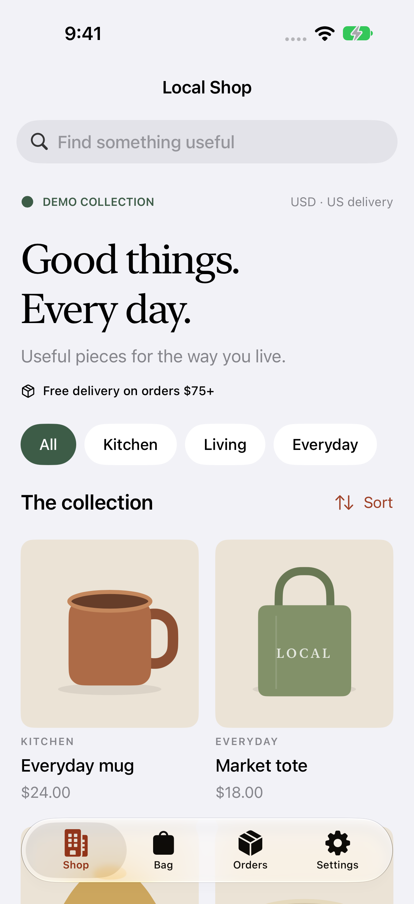
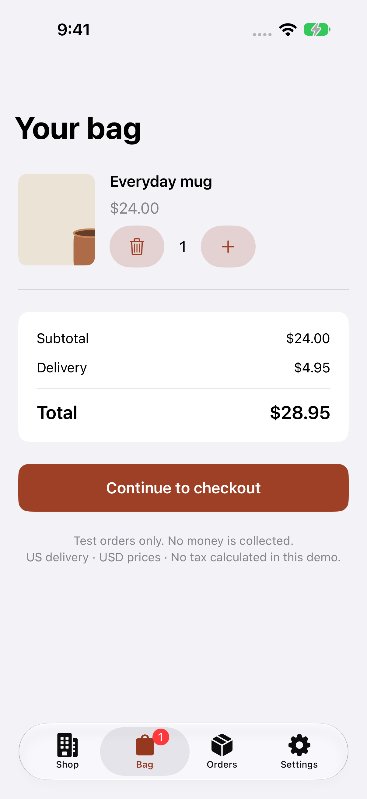
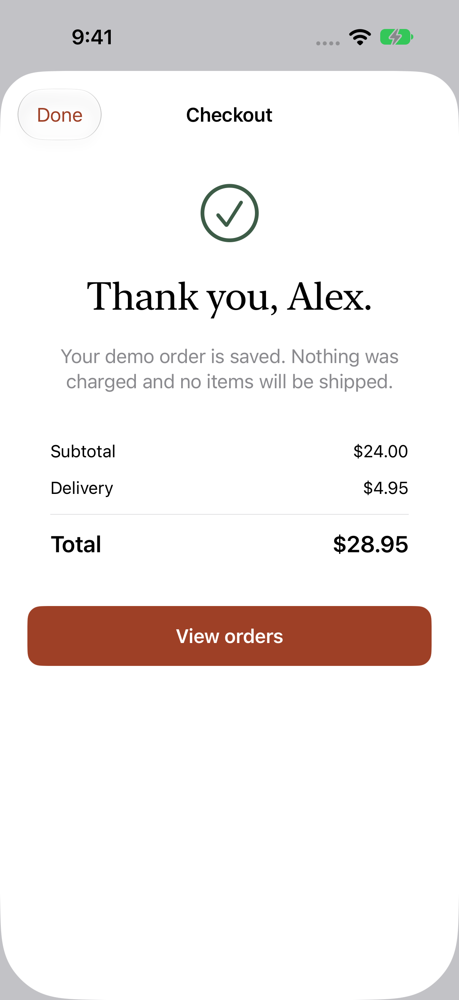

# Local Shop

[](https://github.com/DawoodAamir/Local-Shop/actions/workflows/ci.yml)


A native iOS storefront for useful, everyday homewares. Browse a small collection, build a bag, check out as a guest, and review an itemised order. The app includes a standalone demo and a server-backed mode with SQLite persistence and optional Stripe **test-mode** payments.

**iOS 15+ · SwiftUI · Python 3.10+ · No third-party app dependencies**

## Try it

1. Open `Local Shop.xcodeproj` in Xcode 16 or later.
2. Select **Local Shop** and an iPhone or iPad Simulator, then run.
3. Open **Everyday mug**, add it to your bag, and continue to checkout.
4. Choose **Use sample address**, then **Place test order**.
5. Review the confirmation and open **Orders** for the receipt.

No account, API key, paid Apple developer membership, or server is needed for this walkthrough. Running on a physical device requires selecting your own signing team. The bundle ID is `com.dd.localshop`.

## Screens

  

Screenshots from the running iPhone Simulator are in [Docs/Screenshots](Docs/Screenshots). The product illustrations and app icon are original vector artwork implemented in the repository.

## What works

- Search, category filtering, price sorting, and product details.
- Persistent cart with quantity limits and integer-cent pricing.
- Delivery address validation, shipping threshold, and a clear order total.
- Guest checkout with an idempotency key persisted **before** the request is sent.
- Order history and receipts, including recovery after an interrupted request.
- Separate local data for standalone and connected modes.
- Native light/dark appearance, Dynamic Type, VoiceOver labels, and adaptive grids for iPad.
- A reference HTTP API with server-owned prices, request validation, guest isolation, and durable SQLite orders.
- Optional hosted Stripe Checkout, restricted to test keys. Payment is confirmed by a server-side Stripe lookup, never by trusting the return URL.

## Run the reference server

```sh
python3 Server/server.py
```

In the app, open **Settings**, enter `http://localhost:8080`, and choose **Connect to server**. This address works from the iOS Simulator on the same Mac. The default server creates explicitly labelled demo orders and never calls a payment provider.

For physical devices, supply an HTTPS origin hosted on a reachable server. The app only permits cleartext HTTP for loopback development, and the bundled server binds to `127.0.0.1` by default. See [Server/README.md](Server/README.md) for configuration, API details, and test-payment setup.

## Engineering decisions

| Concern | Approach |
|---|---|
| Deployment target | iOS 15: async URLSession, SwiftUI search, and pull-to-refresh without a newer navigation dependency. |
| State | A main-actor store coordinates small SwiftUI screens; domain models remain independent of SwiftUI. |
| Persistence | Atomic JSON for app state; SQLite transactions and uniqueness constraints for server orders. |
| Money | Integer USD cents. The server recalculates every total from its own catalog. |
| Checkout retries | Persisted request ID and payload; matching retries return the same order. Conflicting reuse is rejected. |
| Guest access | Random 256-bit capability tokens, hashed on the server, stored in device-only Keychain on iOS, expiring after 30 days. |
| Payments | Test-only Stripe Checkout; card data is entered on Stripe, not collected by the app or reference server. |

Read [Docs/Architecture.md](Docs/Architecture.md) for boundaries and failure handling.

## Checks

```sh
swift test
swift test -c release
python3 -m unittest discover -s Server -v
```

For the UI suite, run the reference server first, then choose **Product → Test** in Xcode. The tests use separate app storage and sample delivery details. They cover standalone checkout, real HTTP checkout against the local server, and search with no results. GitHub Actions runs the core, backend, and Simulator tests and builds the Release app.

```sh
xcodebuild -project 'Local Shop.xcodeproj' -scheme 'Local Shop' \
  -configuration Release -sdk iphonesimulator \
  -derivedDataPath build CODE_SIGNING_ALLOWED=NO build
```

## Scope and limits

This is a working portfolio reference, not a deployed retailer. Products, prices, and delivery addresses used in demonstrations are fictional. **No real purchases or deliveries take place.**

- USD and US addresses only; fixed delivery pricing and no tax calculation.
- No stock reservations, merchant dashboard, returns, refunds, or fulfilment integration.
- Guest access is tied to a device and server. No email login, cross-device account, or token recovery.
- Stripe status is reconciled when the order is refreshed. A production service needs signed webhooks, fulfilment jobs, monitoring, abuse controls, retention policies, and a production web server.
- Stripe provider behavior is tested with fixtures. A real Stripe test-account transaction requires your own test key and remains a separate integration check.
- iOS 15 is the compiled deployment target; the initial local UI verification uses an iOS 27 Simulator. Oldest-OS hardware, VoiceOver, and a physical iPad require manual verification.

See [CONTRIBUTING.md](CONTRIBUTING.md) for the manual checklist and [PRIVACY.md](PRIVACY.md) for data handling.

## License

[MIT](LICENSE). Code and original artwork are included. No private App Store account, signing identity, or payment credential is committed.
